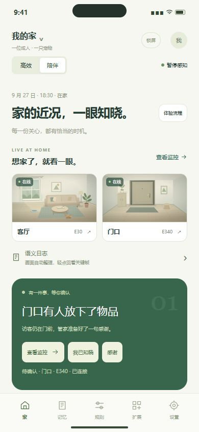
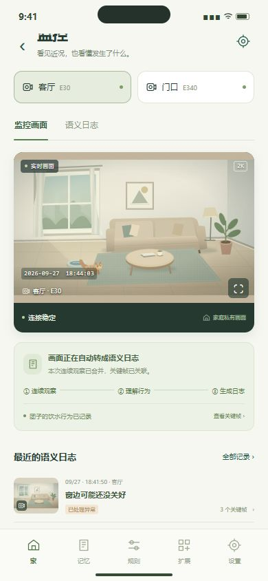
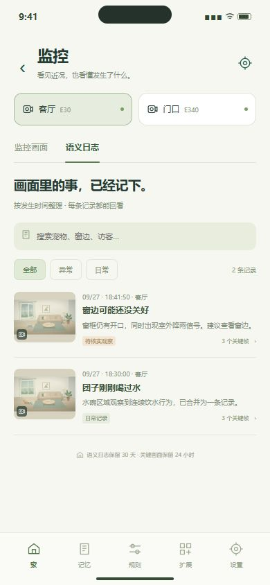
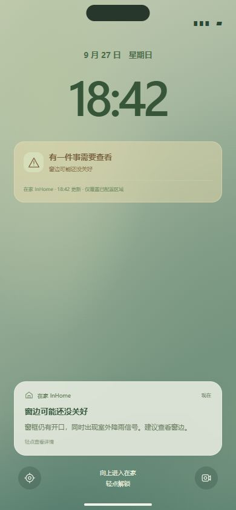
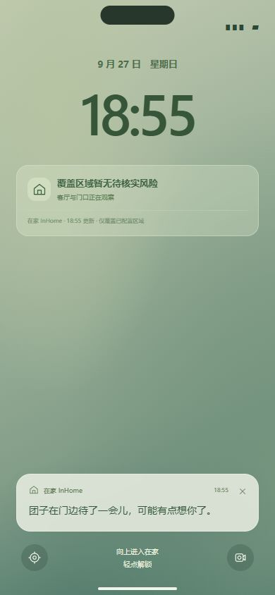
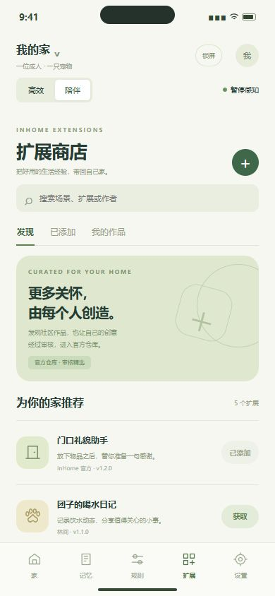

# 在家 InHome

### 把家的近况，放在手心里。

随时看家，记住日常，偶尔唠叨两句。 
重要变化及时告诉你，平常日子也有一句有人味的关心。

[产品介绍](index.html) · [打开交互体验](demo/在家InHome_iOS_Demo.html) · [浏览介绍 Slides](demo/在家InHome_正常运行流程_Slides.html)

## 想家了，就看一眼

打开客厅或门口的相机，看看团子在忙什么、包裹到了没有。首页保留直接入口，家里的画面随手可达。

## 家里发生的事，几句话就看明白

在家把画面里的变化整理成按时间排列的简短记录。“团子在水碗边喝水”“有人在门口放下物品”，翻一翻就知道家里的近况。

想看详细经过，轻点一条记录，画面就回到事情发生的那一刻。

<table>
<tr><td align="center"> 随时查看家中画面</td><td align="center"> 点开记录，回看关键时刻</td></tr>
</table>

## 抬起手机，知道家里的近况

把家庭安全状态留在 iPhone 锁屏上。需要留意的变化会带着原因一起出现，轻点通知，就能查看相关画面。

## 偶尔唠叨两句，让家多一点人味

在家会留意家里的日常和时间，偶尔在锁屏上和你说句话。团子在门边张望，深夜客厅还有活动，都可能成为一句关心的由来：

> “团子在门边待了一会儿，可能有点想你了。”
>
> “很晚了，今天也辛苦啦，早点休息。”

有时让你会心一笑，有时让你想起早点休息。一句随口的唠叨，让手机里的家有了熟悉的温度。

这些消息会自然出现，轻点就能回看相关画面。重要事情优先提醒，日常关心保持偶尔；常驻状态、安全通知和生活消息可以分别设置。

<table>
<tr><td align="center"> 需要留意的变化，及时知道</td><td align="center"> 普通的一天，也有人记挂</td></tr>
</table>

## 说好的事情，替你记着

“明天九点开会。”记下安排，确认提醒时间，到点收到提醒。点一下“我已知晓”，后续跟进就会结束。时间变了，随时修改；事情取消了，也能撤销。

## 关心的分寸，由你决定

选择高效模式，把日常整理进记录；选择陪伴模式，多收到一些家里的小动态。安静时段、提醒偏好和感知开关都由你掌握。

## 把好用的想法，带回自己家

在扩展商店里发现适合自己的作品：宠物饮水记录、雨天关窗提醒、门口礼貌回复……查看介绍和所需权限，再添加到家中。

你也可以描述一个想法，请 Agent 协助创建；有自己的代码，也能直接提交。完成作品后上传审核，通过后进入官方仓库，让更多人用上你的好点子。

## 现在就逛逛在家

下载本仓库后，双击根目录的 `index.html`，即可浏览产品介绍，并进入交互体验和 Slides。GitHub 中的 HTML 链接显示源文件，下载后可直接用浏览器打开。

当前提供可交互的产品体验，iOS App 与设备连接正在开发中。你可以在这里体验完整的界面与操作流程。

有想法或建议？[告诉我们](https://github.com/emme1t/smart-security/issues)。

---

开发与运行信息见 [开发说明](docs/DEVELOPMENT.md)，体验路径见 [使用说明](docs/体验指南.md)。
